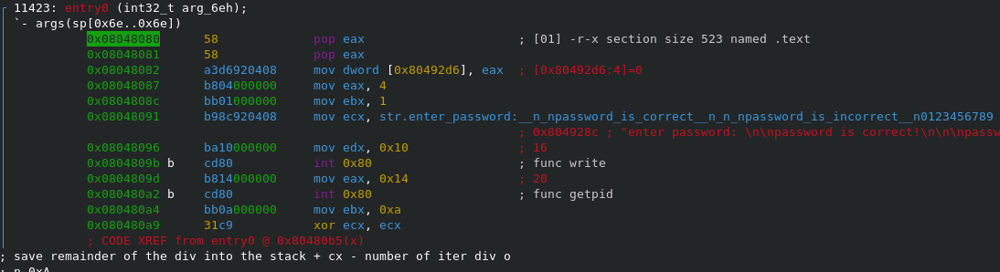
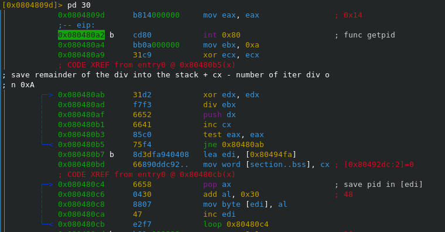
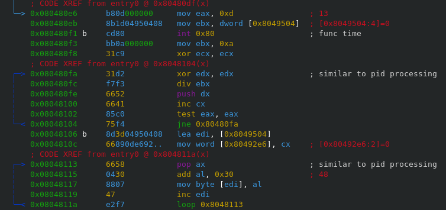
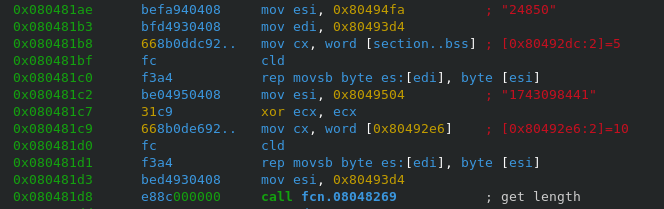
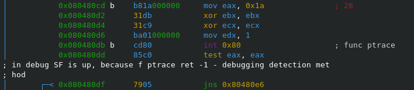
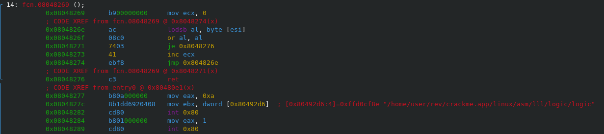
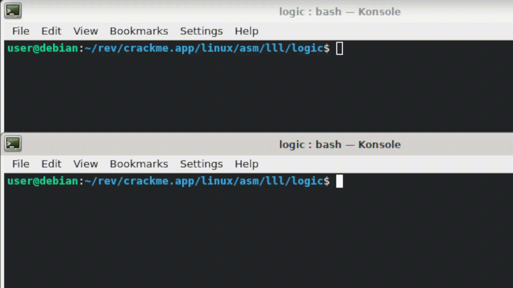

https://crackmy.app/crackmes/basic-logic-by-eholzbach-by-crackmes-de-85983

Приглашение на ввод пароля

Пароль состоит из pid и результата функции time 

Сохранение pid 

Сохранение результата функции time 

Формирование пароля. Строки pid и time складываются

Защита от отладки

При детекте будет удален исследуемый файл

Был создан генератор ключей script.sh

