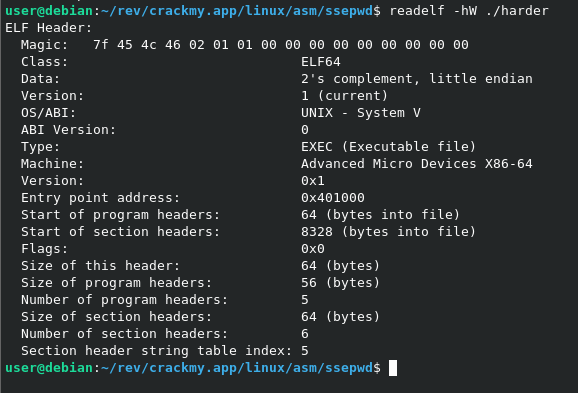
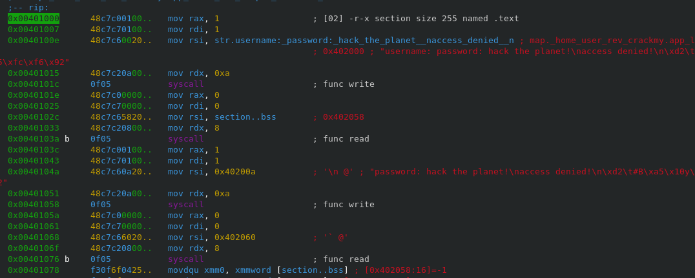
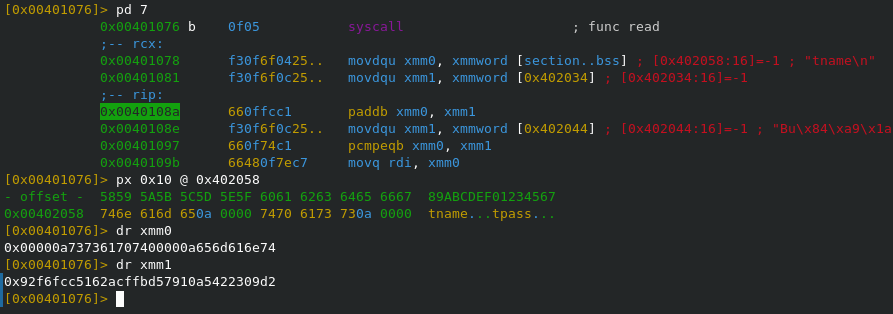
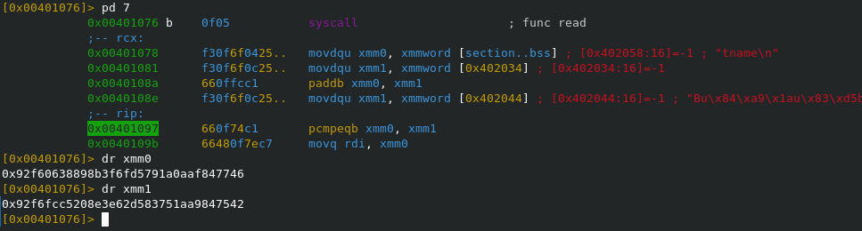
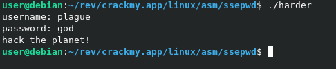

https://crackmy.app/crackmes/sse-login-by-5iriu5-24195

Заголовок файла\

---

Программа принимает на вход 2 строки: имя пользователя, пароль. Каждая до 8 байт с учетеом '\n'\

Имя пользователя хранится по адресу 0x402058, пароль - 0x402060.

---

Далее происходит следующее:
1. В `xmm0` помещается логин и пароль;
2. В `xmm1` помещается 16 байтное значение с адреса 0x402034;\

3. В `xmm0` помещается значение сложения `xmm0` и `xmm1`;
4. В `xmm1` помещается 16 байтное значение с адреса 0x402044;\

5. Значение в `xmm0` сравнивается со значением в `xmm1`;
6. Если совпадут, то победа.

---

Следовательно для победы надо вычислить разницу 16 байтных значений: [0x402044] - [0x402034].\
0x92f6fcc5208e3e62d583751aa9847542 - 0x92f6fcc5162acffbd57910a5422309d2 = 0x000000000a646f67000a657567616c70

---

Если привести в читабельный вид, то получиться:\
имя пользователя - plague\
пароль - god

