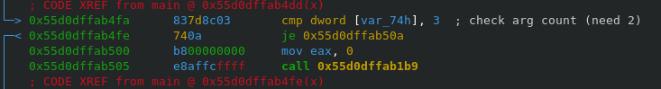
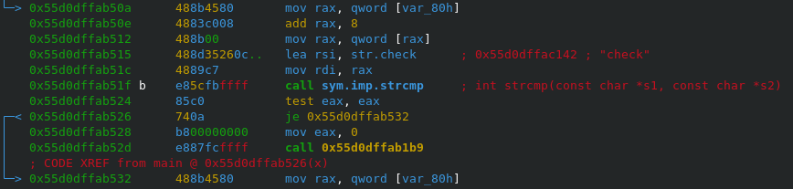
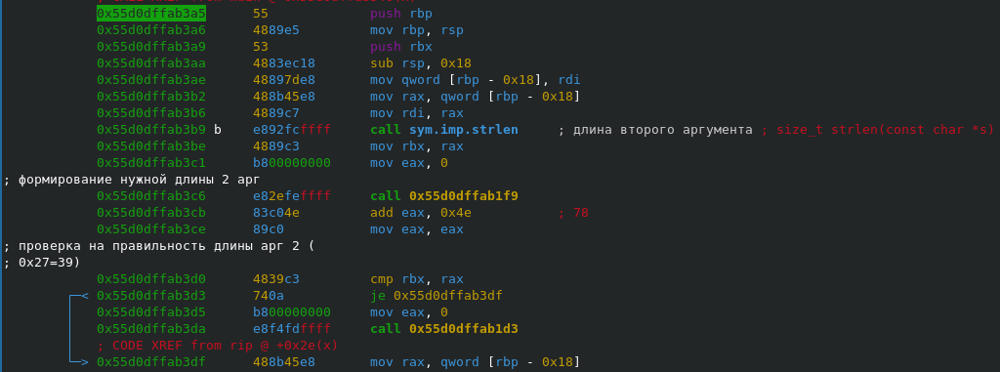
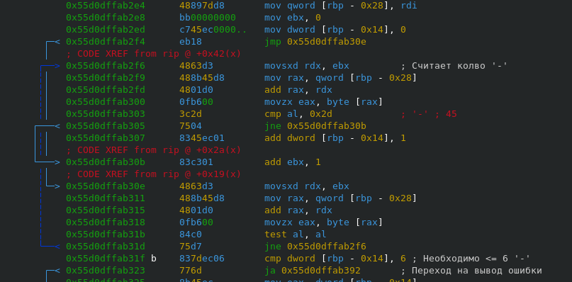
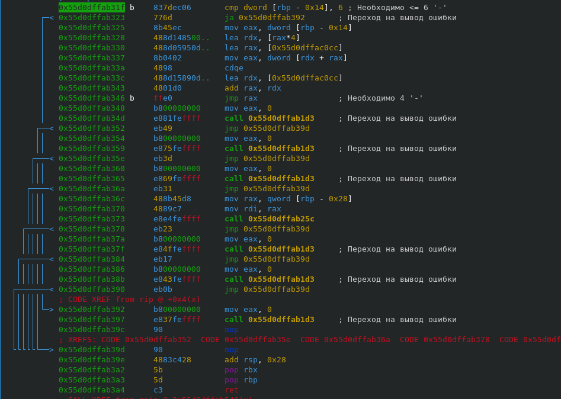
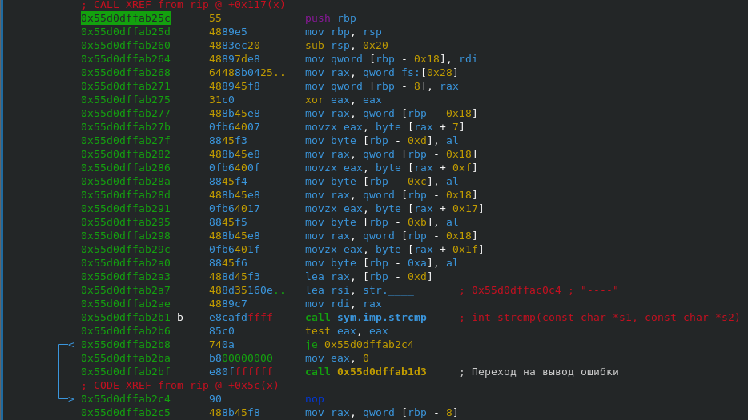
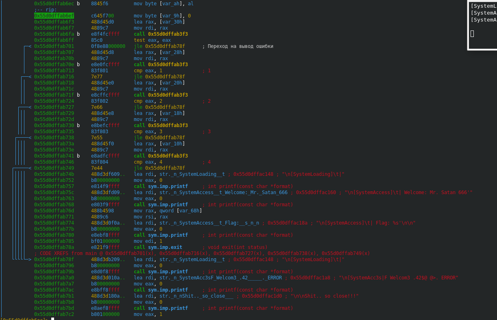
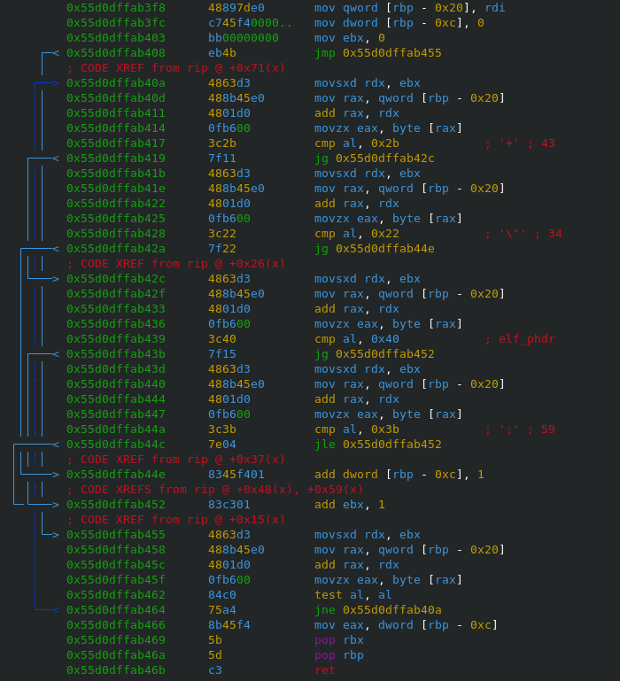
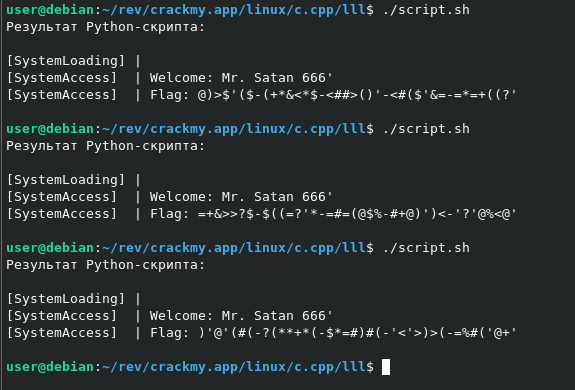

https://crackmy.app/crackmes/easycrack-much0l0k0-by-paypain-25289

Программа требует на вход 2 аргумента\

Первый аргумент должен быть равен 'check'\

Проверка длины второго аргуемента (= 39 байт)\

Проверка количества символов '-' (<= 6)\

Проверка количества символов '-' (= 4)\

Проверка корректности расположения символов '-' (смещения 0x07, 0x0f, 0x17, 0x1f)\

Проверка количества необходимых символов в строках между '-'\
\
Значит:\
1 строка: > 0\
2 строка: > 1\
3 строка: > 2\
4 строка: > 3\
5 строка: > 4

Подсчет количества нужных символов в строках (0x22 < символ <= 0x2b || 0x3b < символ <= 0x40)\

Было создано два скрипта:
 1. script.sh - запускает программу de_mucholoko с аргументами;
 2. keygen.py - генерирует ключ.

 