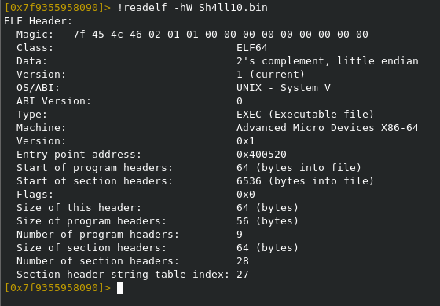
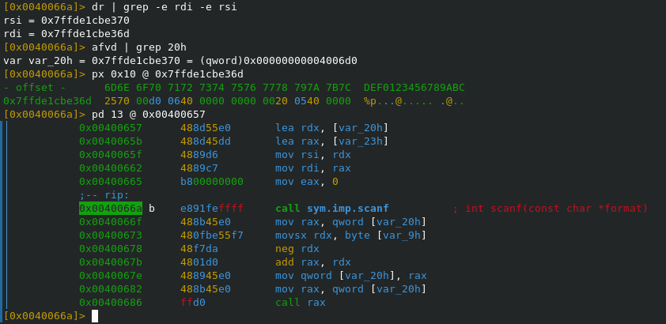
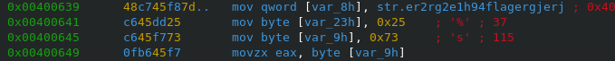
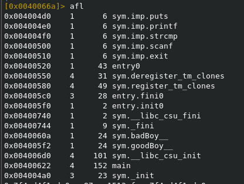
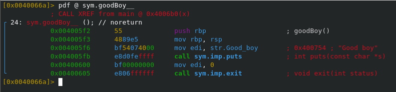
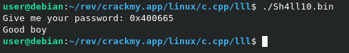

Файл является позиционнозависимым.\

---

Алгоритм работы:
1. Программа принимает на вход адрес, т.к. rdi указывает на "%p";
2. Считанный адрес сохраняется по адресу rsi = var_20h = 0x7ffde1cbe370;
3. Далее к считанному адресу прибавляется neg(byte[var_9h]);
4. Совершается переход по полученному значению.

--

Получается, остается выяснить следующее:
1. Что хранится в var_9h;
2. Куда совершать переход (адрес).
---

В первом байте var_9h хранится 0x73.\

---

В программе есть 2 интересные функции: badBoy и goodBoy.\

---

Содержимое функции goodBoy.\

Из ее функционала видно, что выводится строка о победе, после чего процесс завершается.

--- 

Следовательно нам необходмо ввести такое значение, чтобы после вычитания 0x73 получился адрес 0x004005f2.

0x004005f2 + 0x73 = 0x400665

