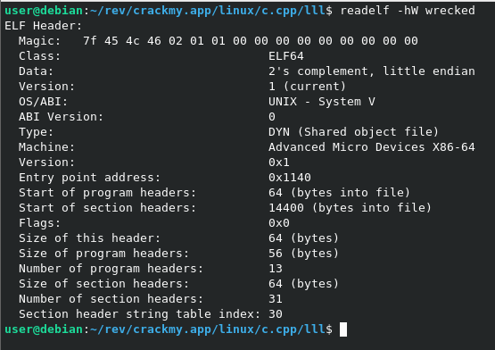
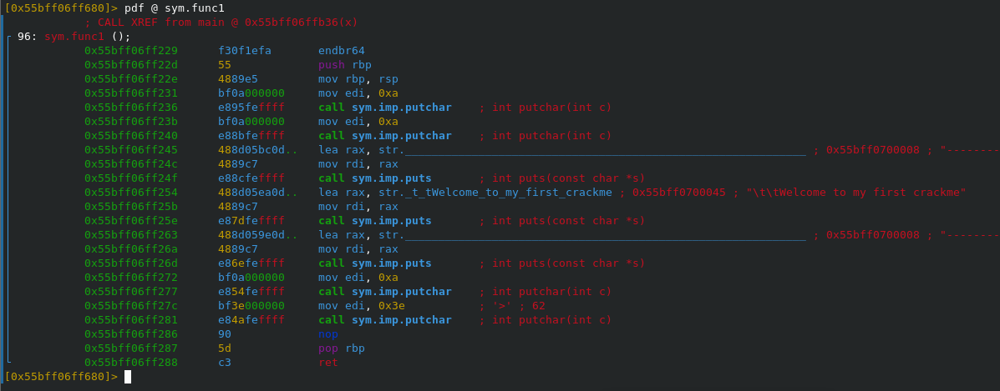
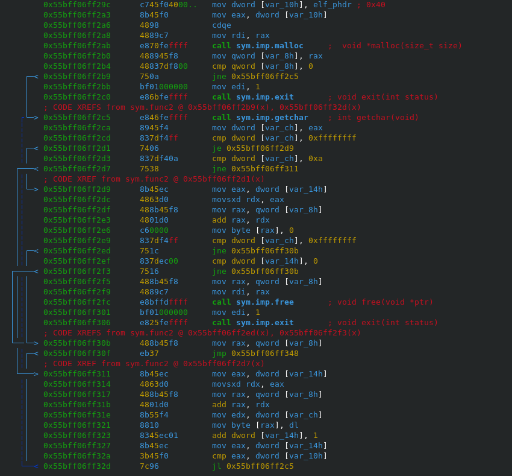
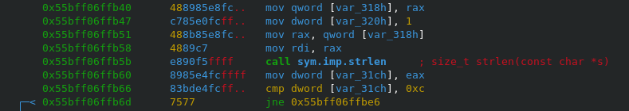
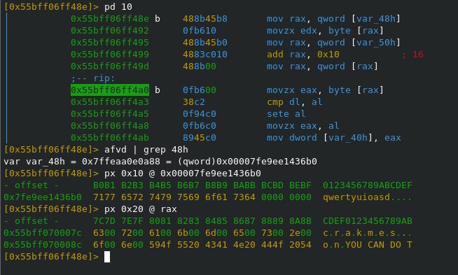
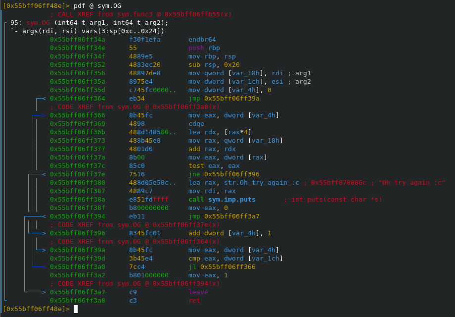
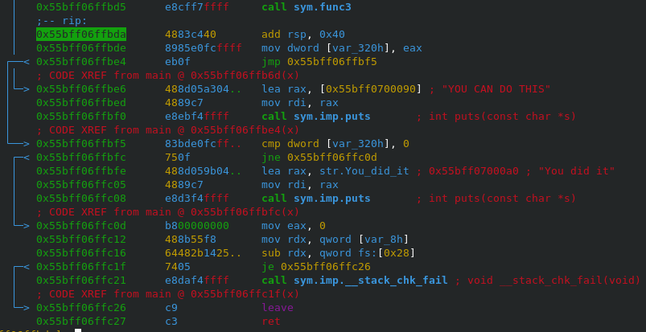
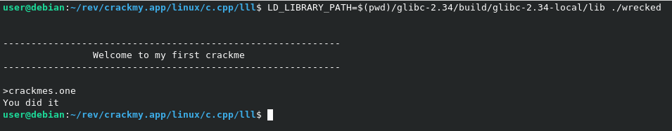

`run.sh` - вспомогательный скрипт запуска приложения с нужной версией glibc.

Если нет нужной версии glibc, то вот небольшой экскурс:
1. Скачиваем необходимую версию
```
wget http://ftp.gnu.org/gnu/libc/glibc-2.34.tar.gz
tar -xvzf glibc-2.34.tar.gz
cd glibc-2.34
```
2. Выполняем конфигурацию
```
mkdir build
cd build
../configure --prefix=$(pwd)/glibc-2.34-local
```
3. Собираем
```
make -j$(nproc)
make install
```

---

Заголовок файла.


---

За вывод строки приглашения отвечает функция `func1`.\


---

За считываение введенной строки отвечает функция `func2`.\
Под строку выделяется память в куче размером 0x40 байт.\


---

Проверка длины введенной строки (необходимо 0xC = 12 байт).\


---

За проверку верности введенной строки отвечает фукнция `func3`.\
В `var_48h` хранится адрес введенной строки. Она сверяется со строкой `crackmes.one`, что и является верной последовательностью.

Фрагмент функции `func3`: проверка валидности первого байта (буква q).\
Если байты совпадают, то сохранятся 1, иначе - 0.\


---

Функция `OG` проверяет наличие 1, что установила функция `func3`.\


---

При верности введенной последовательности функция `func3` возвращает 0, иначе - 1.\


---

Победа\

