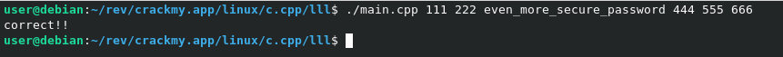

https://crackmy.app/crackmes/main-cpp-3403

Файл `main.cpp` содержит base64-кодированную строку `magic_spell`. Добавляем строку `echo "${magic_spell//�/2}" | tr -d '!' | base64 -d > decoded_output.sh`, чтобы узнать содержимое.

---

Содержимое полученного файла.
```
# decoded_output.sh

out=$(mktemp "something_temporaryXXXXXXXXX")
cat main.cpp | sed "s|file_name|\"./$out\"|; s/extra_secret_password/even_more_secure_password/" | g++ -o $out -x c++ -
chmod +x $out

if [ $# -eq 3 ]
then
	echo wrong...
	exit 0
fi

./$out $3
rm $out
exit 0
```

Из содержимого видно:
1. Создается временный файл;
2. В файле `main.cpp` заменяется строка `file_name` на название временного файла и  `extra_secret_password` на `even_more_secure_password`;
3. Компилируется модифицированный код в временный файл;
4. Завершается процесс, если было передано 3 аргумента;
5. Запускается временный файл с переданным третьим аргументом.

---

Следовательно для решения необходимо передать в `main.cpp` больше 3 аргументов, и 3 аргумент должен быть равен `even_more_secure_password`.

