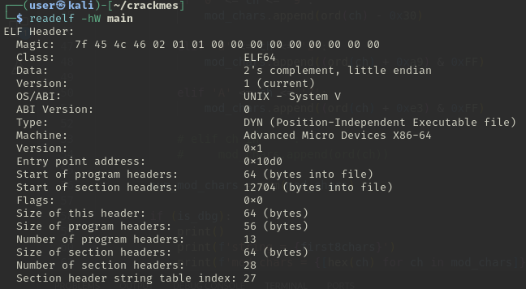
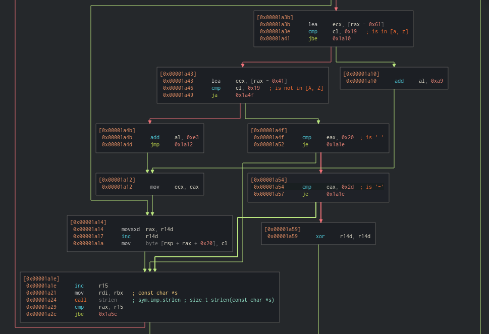
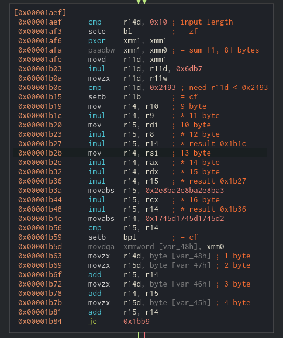
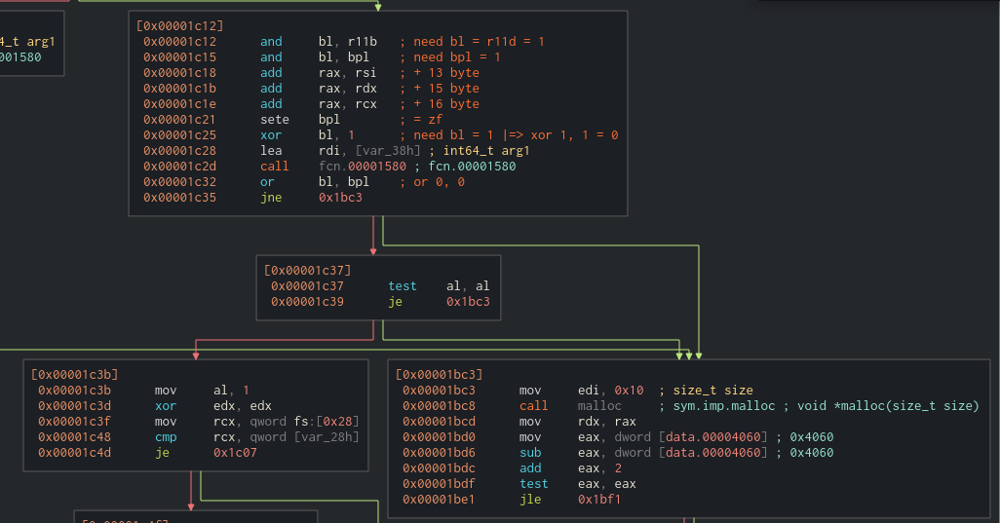
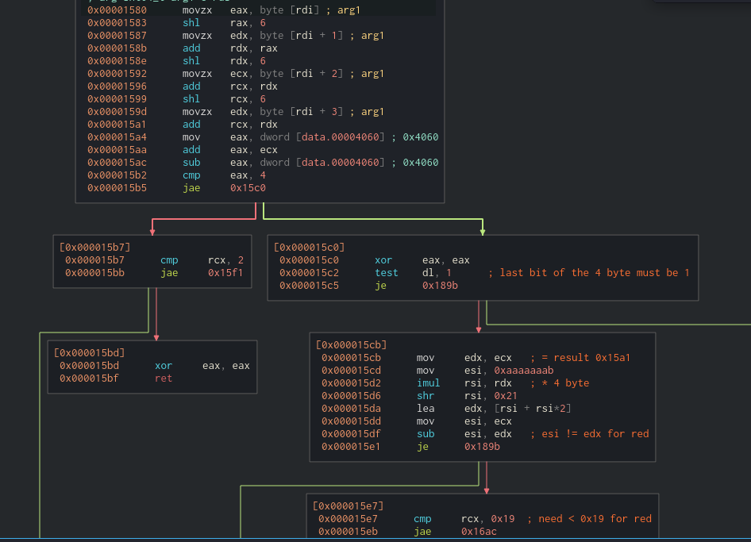
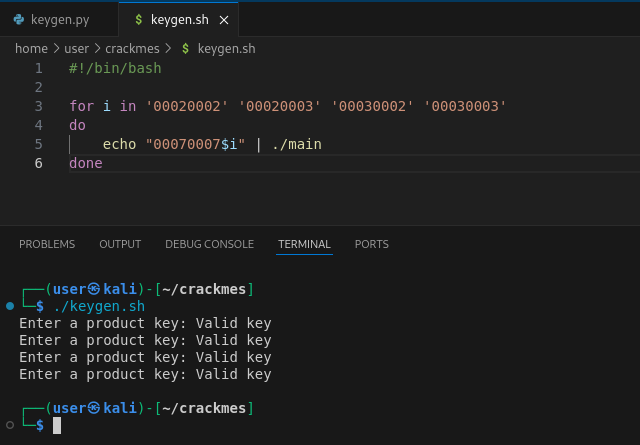

https://crackmy.app/crackmes/primekey-puzzle-by-pyrodeathadder-93775

Заголовок файла\


---

Нам интересны 2 функции:
1. `0x19b0` - должна вернуть `1`;
2. `0x1580` - должна вернуть `1`.

---
Функция `0x19b0`.

Действия:
1. Преобразовывает символы введенной строки;\

2. Присваивает регистрам `bl`, `r11b`, `bpl` значения. Нам необходимо, чтобы значения в указанных регистрах были равны `1`;\
\
`bl = 1`, если длина введенной строки = 0x10.\
`r11b = 1`, если 2 младших байта произведения суммы первых 8 измененных значение и `0x6db7` < `0x2493`.\
`bpl = 1`, если рузельтат многочисленного умножения < `0x1745d1745d1745d2`
3. Изменяет значения `bl` и `bpl` на `0` и вызывает функцию `0x1580`.\


---
Функция `0x1580`.

Действия:
1. Делит измененную строку по 4 байта и считает для каждого блока следующее;\
Фрагмент кода. Код соответствует обработки первго блока. Для остальных 3ех код аналогичен. Поэтому будем рассматривать дальнейшее решение относительно обработки первого блока.\
\
Нам для первых двух блоков интересен путь `0x1580` -> `0x15c0` -> `0x15cb` -> `0x15e7` -> `0x15f1`. Для второго блока подобных путь.\
Для последних двух блоков интересен путь `0x1580` -> `0x15b7` -> `0x15f1`.

---
Решение:
1. Из алгоритма преобразования символов введенной строки видно, что символы цифр преобразовываются из ascii в цифры. (`0x31 - 0x30 = 0x01`)
2. Чтобы последние два блока по 4 символа прошли по заданному пути, они должны быть равны:
```
import random

f'000{random.choice('23')}000{random.choice('23')}'
```

Причины:
* Значение `bpl` в блоке кода [`0x1b19`, `0x1b5d`) будет равно `1`;
* Значение `ecx` в блоке кода [`0x1580`, `0x15b7`) будет равен 4ому символу. Значит символ должен в [2, 4).

3. Чтобы первые два блока по 4 символа прошли по заданному пути, они должны быть равны `00070007`.

Причины:
* Младший бит 4ого символа должен быть равен `1`. (смотри `0x15c2`);
* Значение `ecx` из блока кода [`0x1580`, `0x15b7`)  должно быть < `0x19` (смотри `0x15e7`);
* Следовательно нам подходят `5`, `7`, `9`. Первые 3 символа = `0`;
* Но вспоминаем о значениях в регистрах `bl`, `r11b`, `bpl`. А именно о значении регистра `r11b`. Значение `1` получит регистр `r11b` только при 3ех последовательностях `00050009`, `00070007`, `00090005`.
Вспомогательный код:
```
def ch():
    mod_chars = []
    
    for first8chars in [
        '00050005', '00050007', '00050009',
        '00070005', '00070007', '00070009',
        '00090005', '00090007', '00090009'
        ]:

        for ch in first8chars:
            if '0' <= ch <= '9':
                mod_chars.append(ord(ch) - 0x30)

        sum_mod_chars = sum(mod_chars)
        
        if ((sum_mod_chars * 0x6db7) & 0xFFFF < 0x2493):
            print('-'*10)
            print(f'string = {first8chars}')
            print(f'mod chars = {[hex(ch) for ch in mod_chars]}')
            print(f'sum = {hex(sum_mod_chars)}')
            print(f'imul = {hex(sum_mod_chars * 0x6db7)}')
            print(f'and 0xFFFF = {hex((sum_mod_chars * 0x6db7) & 0xFFFF)}')
            print(f'is < 0x2493 = {(sum_mod_chars * 0x6db7) & 0xFFFF < 0x2493}')
        
        mod_chars.clear()
```
* Теперь осталось обратить внимение на последний момент: блок кода [`0x15cb`, `0x15e7`).\
Вспомогательный код:
```
def check_0x15cb():
    for res in [9, 7, 5]:
        edx = ((0xaaaaaaab * res) >> 0x21) * 3

        if res != edx:
            print(f'good = {res}')
```
Это дает нам понять, что подходит только последовательность `00070007`.

4. Следовательно решение = 
```
#!/bin/bash

for i in '00020002' '00020003' '00030002' '00030003'
do
    echo "00070007$i" | ./main
done
```
