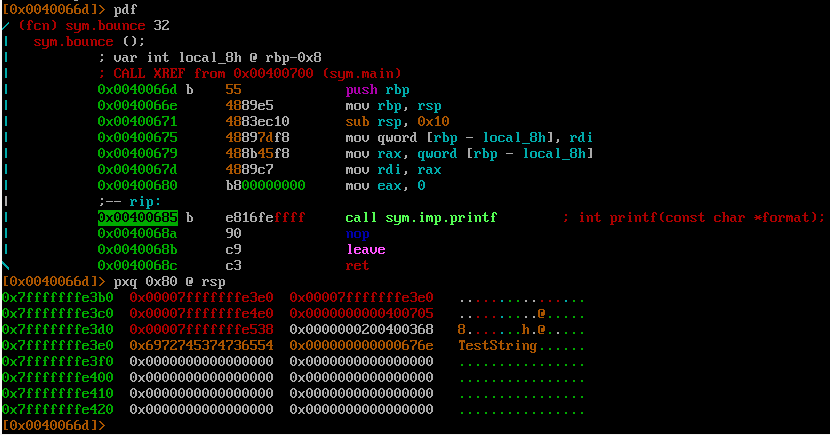
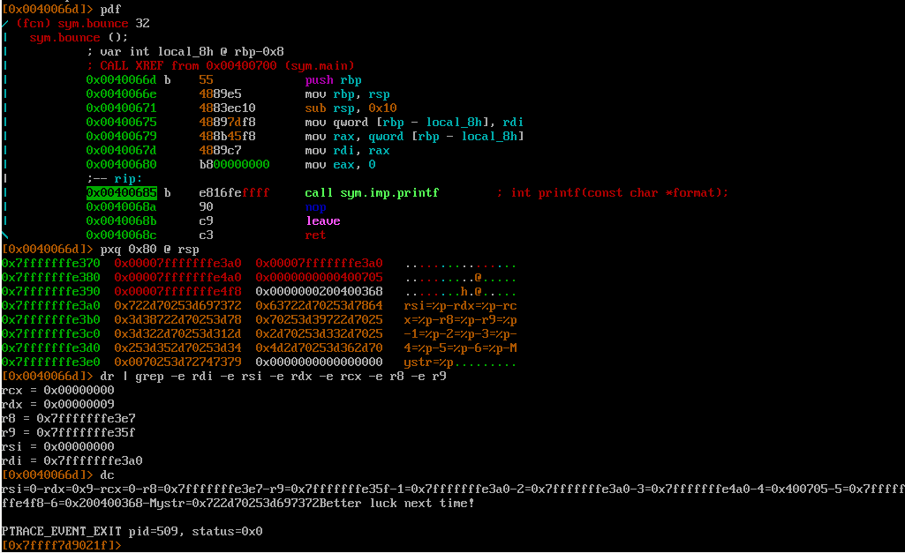
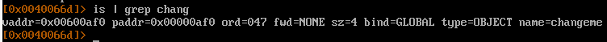
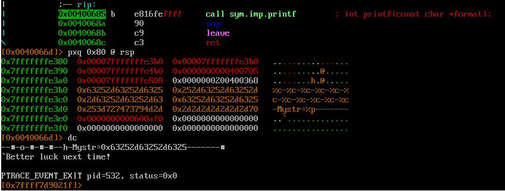
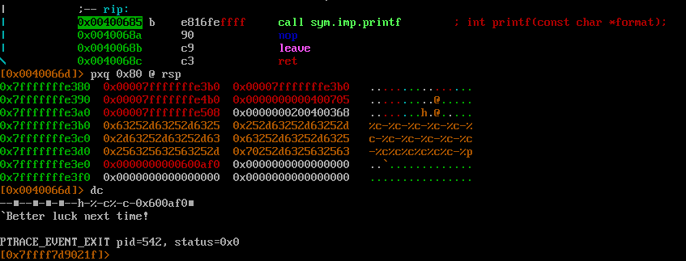
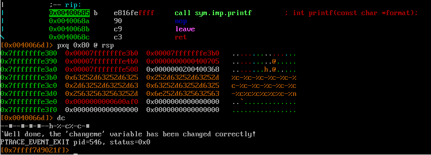

Цель - изменить значение `int changeme;`

Уязвимое место 
```
void bounce(char *str) {
  printf(str);
}
```

Значит необходимо передать программе строку так, чтобы %n записал значение по адресу `changeme`

Ищем смещение `buf` в стеке перед вызовом `printf(str);`\


Т.к. это 64 битная программа, то сначала надо пропустить регистры rsi, rdx, rcx, r8, r9, а уже после 6 qword в стеке (rdi хранит адрес нашей строки (аргумент функции printf))

Проверяем сказанное\


Следовательно необходимо добавить в строку адрес переменной `changeme` + местоположение в стеке должно быть выравнено по 8 байтовой границе.

Адрес \


Формируем строку\


Теперь осталось пропустить 6 qword в стеке, чтобы добраться до переданного адреса переменной `changeme`\


Меняем %p на %n и победа\
