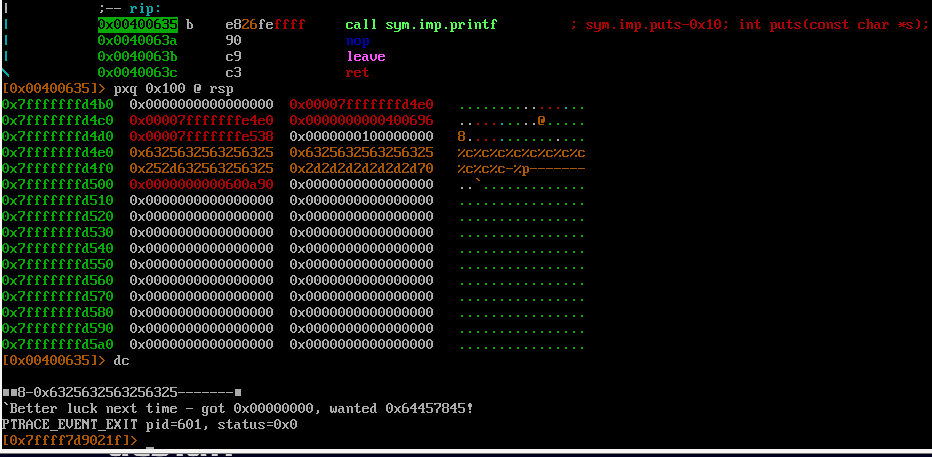

Цель - изменить значение `int changeme;` на 0x64457845

Уязвимое место 
```
void bounce(char *str) {
  printf(str);
}
```

Значит необходимо передать программе строку так, чтобы %n записал значение 0x64457845 по адресу `changeme`

Ищем смещение `buf` в стеке перед вызовом `printf(str);`\


Т.к. это 64 битная программа, то сначала надо пропустить регистры rsi, rdx, rcx, r8, r9, а уже после 6 qword в стеке (rdi хранит адрес нашей строки (аргумент функции printf))

Чтобы изменить значение необходимо добавить в строку адрес переменной `changeme` + местоположение в стеке должно быть выравнено по 8 байтовой границе.

Адрес\


Формируем строку \


Добираемся до переданного адреса переменной `changeme`\


Т.к. необходимо поместить значение 0x64457845, то надо будет забивать недостающее пробелами. Значение 0x64457845 большое, ради интереса разобьем число на два 0x6445 и 0x7845. 0x7845 помещаем по адресу 0x600a90, а 0x6445 - 0x600a92. Формируем строку.\


Пояснение
%hn позваляет записывать word по адресу. %[число]x - дополняет пробелами, что позволяет записать нужное значение по адресу. Сначала мы записываем 0x6445 по адресу 0x600a92, т.к. 0x6445 < 0x7845. Результат работы.\


Победа \
