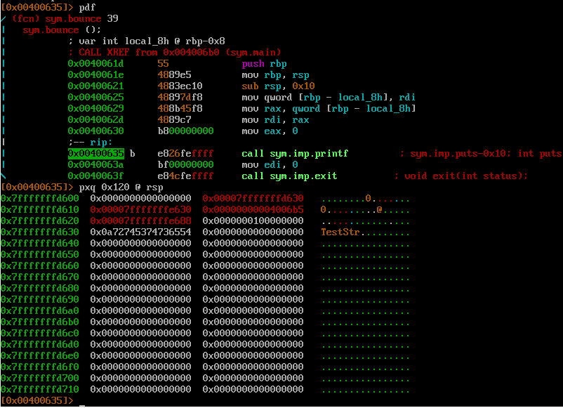
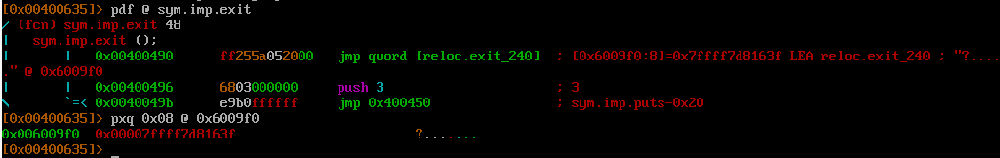
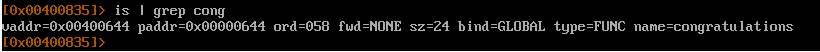
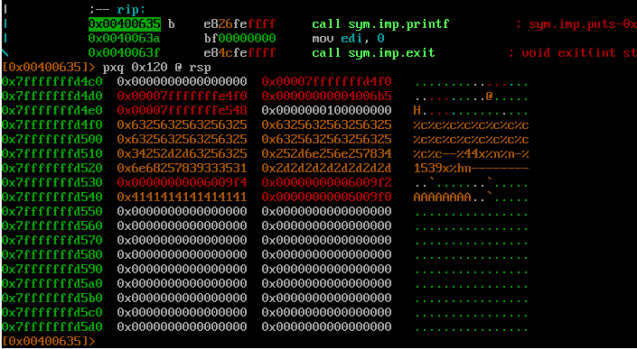
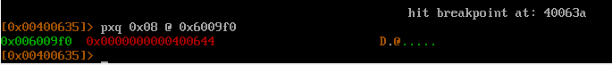
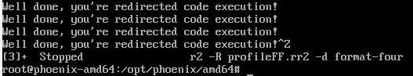

Цель - изменить адрес функции в секции .got `exit` на адрес функции `congratulations`

Уязвимое место 
```
void bounce(char *str) {
  printf(str);
  exit(0);
}
```

Ищем смещение `buf` в стеке перед вызовом `printf(str);`


Т.к. это 64 битная программа, то сначала надо пропустить регистры rsi, rdx, rcx, r8, r9, а уже после 6 qword в стеке (rdi хранит адрес нашей строки (аргумент функции printf))

Чтобы изменить значение необходимо добавить в строку адрес из секции .got, что хранит адрес функции `exit`, + местоположение в стеке должно быть выравнено по 8 байтовой границе.

Нужный адрес 0x6009f0, где надо менять значение


Адрес функции `congratulations`


Формируем строку 


Пояснение.
Разбиваем число 0x400644 (адрес `congratulations`) на два: 0x0040 и 0x0644. Т.к. по адресу 0x6009f0 (адрес в .got) хранится qword (адрес `exit`), то надо обнулить байты с f4 по f7. Для этого записываем dword (использум %n) 0x0040 (недостающее два байта будут = 0) по адресу 0x6009f4, а после по 0x6009f2. После пишим word 0x0644 (используем %hn) по адресу 0x6009f4.

И получается, что по адресу 0x6009f4 будет располагаться адрес функции `congratulations`


Победа (программа будет зациклина, т.к. `congratulations`, вызывая `exit`, будет вызыват себя же)
