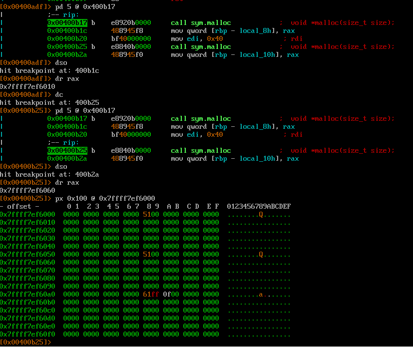
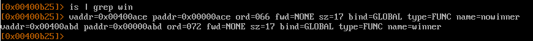
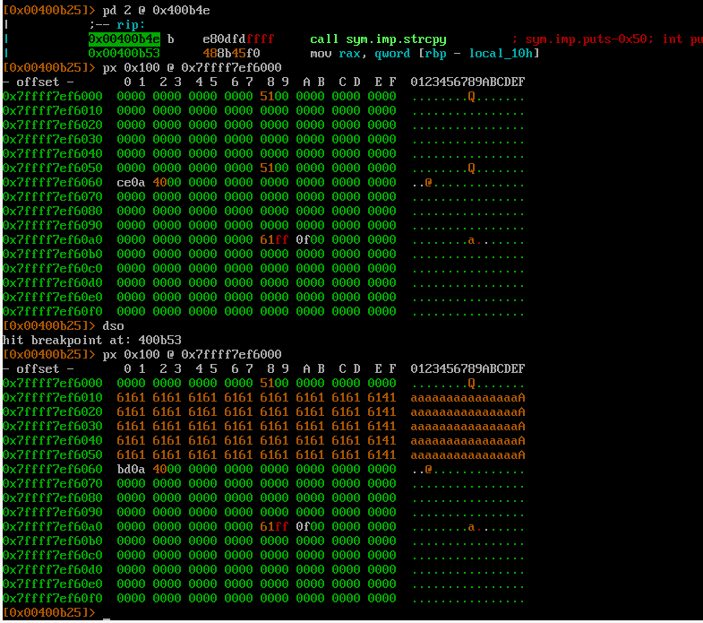
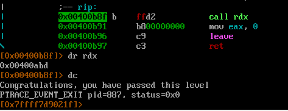

Цель - изменить значение `*fp` на адрес функции `winner`

Уязвимое место `strcpy(d->name, argv[1]);`

Анализируем выделенные адреса под структуры\

0x6010 - структура data
0x6060 - структура fp

51 - размер фрагмента (место под пользовательские данные + 8 байт под размер фрагмента) + флаг

Минимальные размер под пользовательские данные 0x18 байт, дальше прибавляем по 0x10 байт. 
Мы запрашиваем 0x40 байт. То есть 0x18 + 0x10 * 3. Таким образом под запрошенные 0x40 байт выделяется 0x48 байт. 
Размер блока = размер под пользовательские данные + 8 байт под размер блока с флагом = 0x48 + 0x08 = 0x50 байт

И осталось прибавить флаг PREV_INUSE. Таким образом получается 0x51

0x60a0 - верхний блок

Т.к. память не освобождается, то можно перезаписать 0x51.Значит надо передать программе 0x50 байт мусора + адрес функции `winner`

адрес `winner`\

Формируем строку и передаем программе\

Победа\
