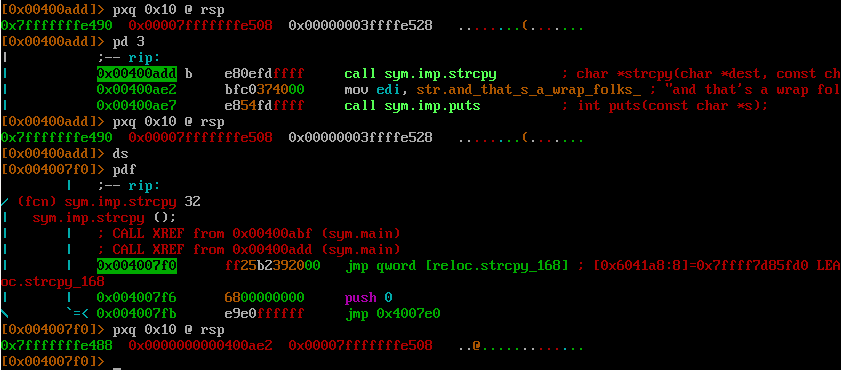
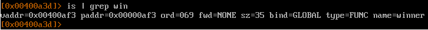
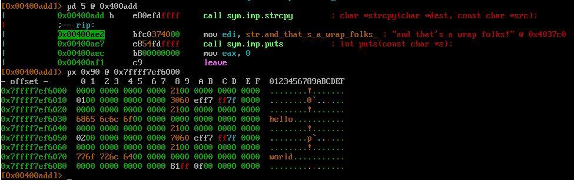
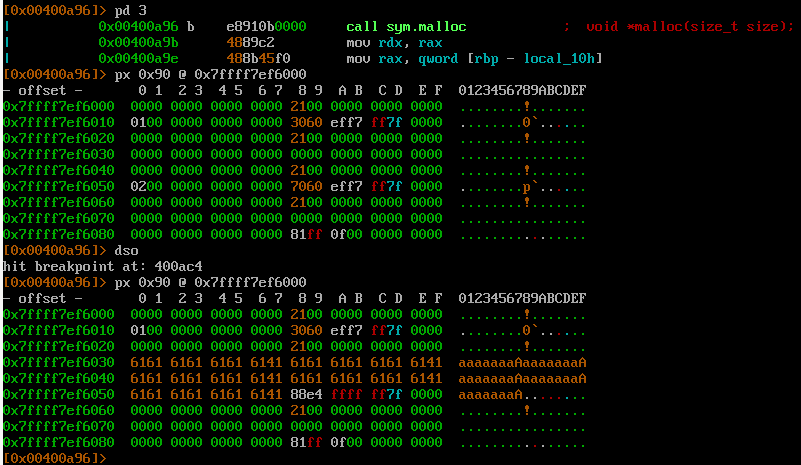
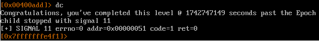

Цель - подменить адрес возварата из последней функции `strcpy` на адрес функции `winner`

Уязвимое место 
```
  strcpy(i1->name, argv[1]);
  strcpy(i2->name, argv[2]);
```

Адрес, где хранится адрес возврата из последней функции strcpy\


Адрес функции `winner`\


Состояние кучи. hello - 1 аргумент, world - второй. 0x6010 - адрес первой структуры, 0x6050 - второй.\


Следовательно необходимо изменить значение по адресу 0x7ffff7ef6058 на значение 0x00007fffffffe488 - адрес, где хранится адрес возврата.

Чтобы решить таск, надо первым аргументом передать 0x28 байт мусора + 0x00007fffffffe488. Втором аргументом передать 0x0000000000400af3

Первый strcpy\


Второй strcpy подменяет адрес возврата из из этой же функции. Поэтому пролетаем до конца выполнения программы.

Победа\

