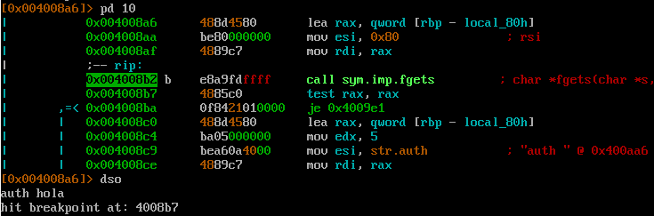
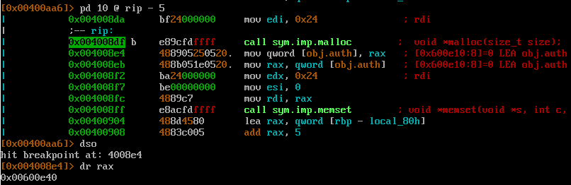
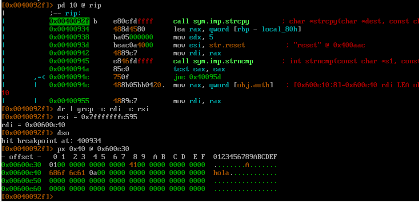
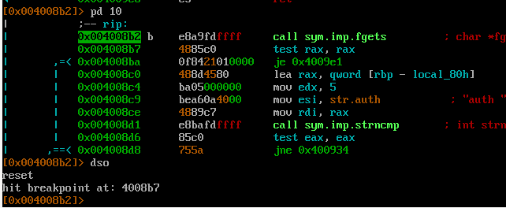
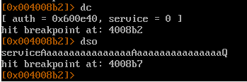
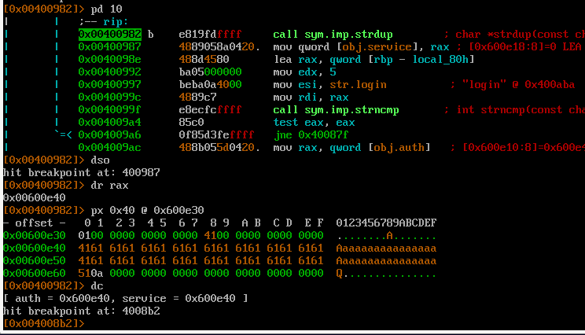
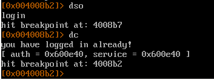

Цель - получить сообщение `printf("you have logged in already!\n");`

Уязвимое место
```
// строка 1
free(auth);
// строка 2
if (auth && auth->auth)
```
т.к. нет проверки, освободилась ли память или нет.

Алгоритм:
1. Выделить память под auth
2. Освободить auth
3. Ввести service, что и заполнит поле `int auth;` структуры `auth`

Вводим команду\


Выделяем память под auth\


Копируем строку auth\


Освобождаем память auth\


Вводим service\


Выделяем память под serivce\

Видим, что адрес расположения совпадает с адресом auth + заполнили поле `int auth;` структуры `auth`

Победа\
